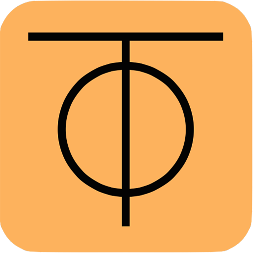

  

<h1 align="center">ZeroTier One</h1>

<em>Global Area Networking</em>

  
  
  
  
  
  

## Quick Links

* [ZeroTier Documentation](https://docs.zerotier.com) - **Start here for downloads, installation, and usage**
* [How to build](build.md) - **Build instructions and platform requirements**
* [Corporate Site](https://www.zerotier.com/)
* [Downloads](https://www.zerotier.com/download/)
* [Service API Reference](service/README.md)
* [Network Controller](nonfree/controller/README.md)
* [Commercial Support](https://docs.zerotier.com/support/)
* [License Information](#license)

## About

ZeroTier One is modern, identity-first software-defined networking for distributed infrastructure. It connects devices, servers, VMs, containers, and applications into one secure virtual network — no matter what sits between them — so they can communicate as if they all reside on the same physical LAN, without specialized hardware or complex VPN configuration.

### How It Works

Instead of relying on physical topology, every device joins a network using its own cryptographic identity. This is built on a secure peer-to-peer transport layer (VL1) combined with an Ethernet virtualization layer similar to VXLAN (VL2), which gives you fine-grained, capability-based access control rules for network micro-segmentation and security monitoring. Access policy is centrally defined and globally enforced, so networks stay resilient and zero-trust by default across public clouds, private data centers, on-prem environments, remote devices, and edge systems.

### Security

All ZeroTier traffic is authenticated and encrypted end-to-end using keys that only you control. Connections are established peer-to-peer whenever possible, with free (but slower) relaying available for devices that can't establish a direct path.

## Platforms

ZeroTier One runs on Linux, macOS, Windows, and BSD. Apps for Android and iOS are available for free in the Google Play and Apple App Store.

## Building and Running

For repository layout, build instructions, platform requirements, and information about running ZeroTier, see [build.md](build.md).

## License

See [LICENSE-MPL.txt](LICENSE-MPL.txt) for all code in node/, osdep/, service/, and everywhere else except ext/ and nonfree/.

See [nonfree/LICENSE.md](nonfree/LICENSE.md) for all non-free ("source available") portions of this repository.

Code in ext/ is external code included for build convenience or backward compatibility and retains its original license.
