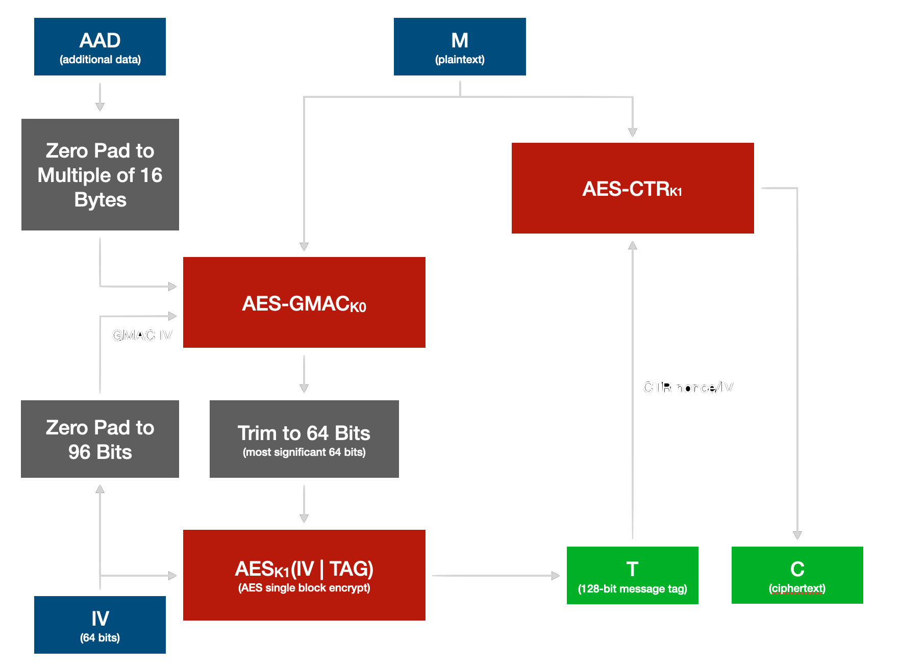

AES-GMAC-SIV
======

This is a Rust implementation of AES-GMAC-SIV, a FIPS-compliant SIV AEAD construction for AES-256. An interface to simple AES-CTR mode is also included.

It's implemented in terms of OpenSSL (libcrypto), macOS/iOS CryptoCore, or (soon) WinCrypt, with the latter two automatically selected at compile time on those platforms.

## Introduction

AES-GMAC-SIV is a "synthetic IV" (SIV) cipher construction implemented using only FIPS and NIST approved cryptographic building blocks: AES and GMAC (the MAC component of GCM). It can for FIPS purposes be described as "AES-CTR authenticated with GMAC" both of which are permitted algorithms. It was created because while similar to [AES-GCM-SIV](https://en.wikipedia.org/wiki/AES-GCM-SIV) that mode uses a non-standard MAC called POLYVAL in place of GMAC. POLYVAL is just GMAC in little-endian, but the fact that it is not standard GMAC means it's not found in most cryptographic libraries and is not approved by FIPS and most other cryptographic standards.

## About SIV Modes

Stream ciphers like AES-CTR, ChaCha20, and others require a number called an initialization vector (IV) for each use. These and most other stream ciphers work by XORing a key stream with plaintext, so if an IV is used more than once security is compromised. Since XOR is commutative, if two different messages are encrypted with the same key stream a simple XOR can reveal that key stream and decrypt both messages. This is a common pitfall with any XOR based symmetric cipher construction.

Repeating the IV is dangerous with many MAC (message authentication) functions as well. [It's particularly dangerous in AES-GCM](https://crypto.stackexchange.com/questions/26790/how-bad-it-is-using-the-same-iv-twice-with-aes-gcm), where one nonce reuse with GMAC (the MAC function in AES-GCM) could allow an attacker to forge messages.

SIV stands for *synthetic IV*. SIV modes work by applying a MAC function to the plaintext first, then using the resulting authentication code plus an IV to initialize a stream cipher. This provides much stronger protection against IV reuse by making the actual IV dependent on the plaintext. Changes to the plaintext will therefore change the IV even if the one supplied to the function is duplicated.

SIV modes might seem like paranoia, but accidental IV reuse is easier than you might think. Here's a few scenarios where it might happen:

 * Backing up and restoring counter or random seed files.
 * Live cloning of virtual machines or application state, resulting in two clones with identical counters or random number generator states.
 * Forgetting to use atomics or a mutex to synchronize an IV counter or a non-thread-safe random number generator.
 * Hardware differences in concurrent memory access behavior causing synchronization issues when code is ported to new architectures.
 * Embedded devices that lack a good source of randomness or have poorly implemented random initialization.
 * Memory errors that corrupt an IV counter variable, especially if they can be triggered remotely.
 * Time changes or attacks against NTP if a clock is used as an input in initializing a counter or random source.
 * Rapid restarts of a service where clock is used as an input in IV initialization.

... and so on. "Sudden death" on IV re-use is a foot-gun that's worth removing.

## AES-GMAC-SIV

*Inputs are green, outputs are blue. Grey indicates simple non-cryptographic operations. Red indicates cryptographic steps.*

Two initialization keys, which can be derived from a single key using a key derivation function or hashing with a 512-bit hash function and using the first and second 256 bits:

 1. K0, a 256-bit AES key used to initialize AES-GMAC.
 2. K1, a second (and different) 256-bit AES key used to initialize AES-ECB and AES-CTR.

Per-message parameters:

 1. A per-message unique 64-bit IV (can be a counter or random, though a non-overlapping counter is preferred).
 2. Optional additional associated data (AAD) to authenticate but not encrypt.
 3. A plaintext message to encrypt.

Encryption steps:

 1. Pad 64-bit IV to 96 bits with zeroes and use it to initialize GMAC.
 2. Feed AAD (if any) into GMAC prior to plaintext.
 3. Pad AAD length to a multiple of 16 by feeding zeroes into GMAC to ensure unique encoding.
 4. Feed plaintext into GMAC to compute final MAC.
 5. XOR lower 64 bits and higher 64 bits of 128-bit GMAC tag to yield a 64-bit tag.
 6. Concatenate original 64-bit input IV and 64-bit shortened tag to form a 128-bit block.
 7. AES-ECB encrypt this IV+tag, yielding an opaque 128-bit message tag and AES-CTR IV. (ECB is secure if only one block is encrypted.)
 8. Clear bit 31 (from the right) in the tag and use this to initialize AES-CTR with the first 96 bits being the AES-CTR IV and the remaining 31 bits being the AES-CTR "index" or counter. This provides what amounts to a 127-bit AES-CTR IV. The most significant bit of the counter is cleared so that poor quality AES-CTR implementations that only use a 32-bit wrapping counter will not wrap at message sizes up to 2^31 bytes. Wrapping technically wouldn't hurt anything unless the implementation generates a fault on wrap, but avoid this in case some cryptographic accelerator somewhere does so.
 9. Encrypt plaintext with AES-CTR and send this along with the encrypted IV+tag from step 7 (without CTR counter bit 31 cleared). The per-message unique 64-bit IV supplied by the caller at encryption **should not** be sent as it is recovered during decryption by decrypting the IV+tag blob. Sending it wastes space and reveals slightly more state information to an attacker, since without the input IV an attacker doesn't know if it has in fact been duplicated.

Decryption steps:

*Decryption reverses encryption steps 8, 9, 7, 1, 2, 3, 4, and 5, then authenticates.*

 1. Initialize AES-CTR IV with the tag after clearning bit 31 as in step 8 above.
 2. Decrypt ciphertext with AES-CTR.
 3. AES-ECB *decrypt* 128-bit tag to yield original IV and 64-bit shortened GMAC tag.
 4. Initialize GMAC using first 64 bits of the *decrypted* message tag and zero pad to 96 bits (as in encryption step 1).
 5. Feed AAD into GMAC (if any) (as in encryption step 2).
 6. Zero-pad AAD to a multiple of 16 (as in encryption step 3).
 7. Feed *decrypted plaintext* into GMAC.
 8. Generate GMAC tag, XOR least and most significant 64 bits, and check MAC. Discard packet if these do not match.

## Performance

Performance is very close to AES-GCM on a given platform. It's very slightly slower because encryption requires two passes, but for short messages the second pass will operate on data already in the CPU's L0 cache which minimizes the actual overhead.

You can run tests with `cargo test --release -- --nocapture` and see encrypt and decrypt performance. Here's some single core benchmarks:

 * AMD Threadripper 2990WX: **2055.60 MiB/sec**, decrypt **2050.09 MiB/sec** (per core).
 * Apple M1 Mac Mini (2021): encrypt **4868.89 MiB/sec**, decrypt **5059.39 MiB/sec** (per performance core).

In general this construction performs better than ChaChaPoly or other ARX ciphers on processors that have AES hardware acceleration and considerably worse on processors that lack it. Performance on systems without hardware acceleration is generally still good enough for most applications.

## Security

[Trail of Bits](https://www.trailofbits.com) analyzed AES-GMAC-SIV as part of their [design analysis of ZeroTier 2.0](https://github.com/trailofbits/publications/blob/master/reviews/ZeroTierProtocol.pdf) and concluded that its security is equivalent to the original AES-SIV and AES-GCM-SIV constructions.

The algorithms on which this is built, namely AES, AES-CTR, and GMAC, are well known and standard.

## FIPS Compliance

AES-CTR, AES-ECB, and GMAC are all algorithms allowed by FIPS-140. For FIPS purposes AES-GMAC-SIV would be described as AES-CTR with GMAC authentication. Since this is built out of entirely standard building blocks, a FIPS certified cryptographic library can be used to implement it.

## License

This Rust implementation of AES-GMAC-SIV is released under the BSD 2-clause license.

(c) 2021-2022 ZeroTier, Inc.
