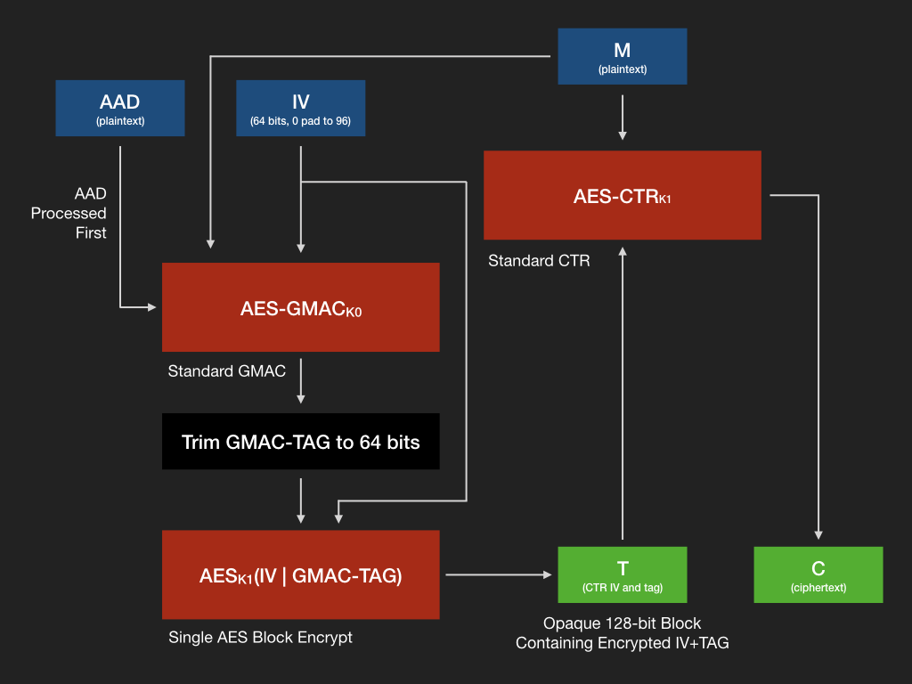

ZeroTier security and cryptographic design
=======

(c)2020 ZeroTier, Inc.  
Author(s): Adam Ierymenko <adam@zerotier.com>

# Introduction

This document describes the core components of ZeroTier's cryptographic and security architecture. It focuses primarily on version 2.0 and only briefly touches on v1.x constructions that are being phased out.

The intended audience for this document is developers, auditors, and security professionals wishing to understand ZeroTier's design from a security posture point of view. It's also written to serve as the basis for professional security audits of the ZeroTier protocol and code base.

## High-Level Protocol Design

ZeroTier's protocol is split into two conceptual layers that we term **VL1** and **VL2**.

VL1 stands for *virtual layer 1* and is a cryptographically addressed secure global peer-to-peer network responsible for moving packets between ZeroTier nodes. It's a virtual analogue of the physical wire or radio transciever in an Ethernet or WiFi network respectively. Think of it as a gigantic wire closet for planet Earth.

VL2 stands for *virtual layer 2* and is a full Ethernet emulation layer incorporating cryptographic certificate and token based access control. It is similar (but not identical) to other Ethernet virtualization protocols like VXLAN. VL2 is conceptually separate from VL1 but for the sake of simplicity and ease of use leverages VL1's cryptographic infrastructure for its own authentication needs.

## VL1 Asymmetric Cryptography: Identities, and Addressing

VL1 peers are cryptographically addressed, meaning addresses are strongly bound to public keys. Cryptographic addressing is extremely convenient in peer-to-peer networks as it leverages authenticated (AEAD) encryption to implicity authenticate endpoint addresses.

A ZeroTier identity is comprised of one or more cryptographic public keys and a short **ZeroTier address** derived from a hash of those keys. In addition to this short address there also exists a longer fingerprint in the form of a SHA-384 hash of identity public key(s).

#### Identity Types and Corresponding Algorithms

* **Type 0** (v1.x and v2.x): one Curve25519 key for elliptic curve Diffie-Hellman and one Ed25519 key for Ed25519 signatures, with the address and fingerprint computed from a hash of both.
* **Type 1** (v2.x only): Curve25519, Ed25519, and NIST P-384 public keys, with the latter being used for signatures (the Ed25519 key is still there but is presently unused) and with *both* keys being used for elliptic curve Diffie-Hellman key agreement. In key agreement the resulting raw secret keys are hashed together using SHA-384 to combine them and yield a single session key.

Session keys resulting from identity key exchange and agreement are *long-lived keys* that remain static for the lifetime of a particular pair of identities. A different mechanism is used for ephemeral key negotiation.

#### ZeroTier Addresses and Identity Fingerprints

In the simplest form of cryptographic addressing, keys are used directly as addresses throughout the system. Unfortunately even public key cryptosystems with short keys like Curve25519 still result in string representations that are prohibitively long for human beings to type. ZeroTier mitigates this usability problem by using a short hash of the public key termed a **ZeroTier address** to refer to a peer's full identity. This short address is also used at the wire level to reduce the size of the packet header. Peers may request full identities based on addresses from from root servers.

ZeroTier addresses are very short: only 40 bits or 10 hexadecimal digits, e.g. `89e92ceee5.` This makes them convenient to type, but such a short hash would in a naive implementation introduce a significant risk that an attacker could create a duplicate identity with a different key pair but the same address. With 40 bits an intentional collision would require only an average of about 549,755,813,888 attempts for a 50% chance of colliding. If an attempt requires 0.5ms of CPU time on a typical contemporary desktop or server CPU, this would require about 3,000 CPU-days. Since this type of search is easy to parallelize, it would take only a few days for someone with access to a few thousand CPU cores.

To provide this short hash with a larger security margin, an intentionally slow one-way "hashcash" or "proof of work" function is required during identity generation. This work function is slow to compute but fast to verify, and an address is not valid unless its work checks out. This gives identity address derivation the following costs:

* Type 1 identities: an average of about 500ms per key pair per typical 2.4ghz CPU core, requiring around 3 million CPU-days to reach a 50% collision probability.
* Type 2 identities: an average of about one second per key pair per typical 2.4ghz CPU core, requiring around 6.3 million CPU-days to reach a 50% collision probability.

While too costly for the vast majority of attackers, this cost may not be prohibitive to a nation-state level attacker or to a criminal with significant funds and/or access to a very large "botnet." It's also possible that FPGA, GPU, or ASIC acceleration could be leveraged to decrease this time in a manner similar to what's been accomplished in the area of cryptocurrency mining.

Fingerprints are full SHA-384 hashes of identity public keys. In base32-encoding they look like this:

```
bzg7fc3sn46fzyxcxw2ev4c4m2u5fyisb3o4wz5hfmvexbzwk6et3fsglkdcn6nnjobxi3bq7hgxqox3n4u4k
```

These are too large to type but not to copy/paste, store in databases, or use in scripts and APIs.

## VL1 Wire Protocol

ZeroTier's wire protocol is packet based with packets having the following format:

```
[0:8]    64-bit packet ID and cryptographic nonce
[8:13]   40-bit destination ZeroTier address
[13:18]  40-bit source ZeroTier address
[18:19]  8-bit cleartext flags, cipher, and hop count (bits: FFCCCHHH)
[19:27]  64-bit message authentication code (MAC)
-- BEGIN ENCRYPTED SECTION --
[27:28]  8-bit inner flags and 5-bit protocol verb (bits: FFFVVVVV)
[28:...] Verb-specific packet payload
```

All fields (both those that remain cleartext and those that are encrypted) in a packet are authenticated except for the last three "hops" bits of the combined flags/cipher/hops field. These are masked to zero during MAC computation and verification. This is because the hops field is the only field that can be modified by third party peers in transit. It's incremented whenever a packet is forwarded by a root server or connectivity-assisting peer and is checked against a limit to prevent infinite forwarding loops.

Packets can be up to 16,384 bytes in size. Since the most common transport is UDP and this transport does not reliably support fragmentation, ZeroTier implements its own packet fragmentation and re-assembly scheme using fragments with the following wire format:

```
[0:8]    64-bit packet ID of packet of which this is a fragment
[8:13]   40-bit destination ZeroTier address
[13:14]  0xff here indicates a fragment since addresses cannot start with this byte
[14:15]  4-bit total fragments and 4-bit fragment number (bits: TTTTNNNN)
[15:16]  5 reserved bits, 3-bit hop count (bits: rrrrrHHH)
[16:...] Fragment data
```

A fragmented packet is indicated by the presence of the flag 0x40 in its cleartext flags field. If this flag is present the receiver must expect the receipt of one or more fragments in addition to the packet's header and first fragment. The total number of fragments expected is not contained in the header but will be contained within each subsequent fragment. If a fragment is received prior to its head, it's held in the event that its head arrives as the protocol does support out of order receipt of fragments.

Fragmentation can be effectively ignored from a security point of view (with the exception of denial of service concerns, which are mitigated by way of limits and heuristics in the code) since packet message authentication codes are checked at the packet level. Any improperly fragmented packet will fail cryptographic MAC check and be discarded.

*Legacy: In v1.x the packet ID and nonce field was assigned from a counter maintained to avoid duplicate nonce assignment and the MAC field was the first 64 bits of a Poly1305 MAC of the packet. The overall construction was identical in form to the NaCl Salsa20/Poly1305 "secret box" construction in which the first 32 bytes of Salsa20 output are used as a one-time Poly1305 key for each packet.*

In v2.x the packet ID and MAC field are in reality a single split 128-bit encrypted nonce and MAC field. See AES-GMAC-SIV below.

## Symmetric Encryption: AES-GMAC-SIV

**This is a draft and may change based on peer review and feedback.**

In v1.x there is a risk of nonce re-use due in part to the small size of the MAC and in part to the way ZeroTier is used. More specifically the risk arises when ZeroTier VMs are cloned or ZeroTier is used on small devices that have the potential to lack both accurate timekeeping and native strong random sources.

Salsa20 was used in v1.x since at the time the protocol was initially designed AES acceleration was not available on most mobile phones, embedded chips, and small ARM processors such as those use on Raspberry Pi and similar devices. This is no longer the case.

For v2.x our design has three objectives:

- Make use of FIPS140-compliant cryptographic primitives that would be available in a FIPS140-ceritified library (e.g. a FIPS build of crypto++ or openssl libcrypto), and use them in a way that could pass FIPS/NIST/NSA review.
- Use AES with hardware acceleration for extremely high performance processors with AES hardware acceleration, which is most non-trivial CPUs today.
- Incorporate some form of nonce-reuse-resistance to reduce the risk of duplicate nonces when virtual machines are cloned or on small devices, and to mitigate the short MAC.

The proposed AES-GMAC-SIV construction attempts to achieve all these objectives by using GMAC combined with AES-CTR (both FIPS140 primitives) in a way that achieves the security bounds and characteristics of AES-GCM-SIV but could be certified as FIPS compliant. The design is almost identical to another proposed mode called AES-GCM-SIV except that GMAC is used "as-is" for FIPS-certifiability reasons.

#### AES-GMAC-SIV Session Setup

For each new session key, derive two sub-keys **K0** and **K1** using a key derivation function such as KBKDF-HMAC-SHA384.

#### AES-GMAC-SIV Encryption



As with all other SIV (synthetic IV) modes of operation, encryption requires two passes. Since messages are small in our system it's very likely that the second pass would be operating on data already in CPU L0 cache, reducing the additional overhead of this two-pass requirement.

1. Generate a new unique 64-bit packet ID in the same manner as v1.x.
2. Expand this 64-bit ID to a 96-bit AES-GMAC nonce by padding the remainder with the size of the packet in bytes and the direction of communication (sender > recipient or recipient > sender). This adds a small amount of additional entropy taken from characteristics of the packet.
3. Using session sub-key **K0** compute AES-GMAC(K0, plaintext) to yield a 128-bit GMAC tag.
4. Take the first 64 bits of this 128-bit GMAC tag and append it to the 64-bit packet ID generated in step 1 to yield a 128-bit combined nonce+MAC field.
5. Obtain a 128-bit AES-CTR nonce by encrypting this 128-bit combined nonce+MAC field as a single AES block using **K1**. This is done because GMAC alone is not a cryptographic PRF (pseudo-random function) and we want to ensure that we destroy any algebraic structure before using it with AES-CTR.
6. Using the encrypted nonce+MAC field as a 128-bit nonce, encrypt the encrypted section of the packet with AES-CTR. This is also done using **K1**, meaning that the first block of CTR padding data is actually AES(K1,AES(K1,nonce+MAC)).
7. Encrypt the 128-bit AES-CTR nonce again as a single AES block using **K0** to yield a final encrypted 128-bit combined nonce and MAC. *(Question for peer review: does this step have any attack-mitigating value? AES-CTR does not require that its nonce/IV be a secret.)*
8. Split this final encrypted nonce+IV into two 64-bit chunks, replacing the packet ID with one and placing the other in the packet MAC field.

#### AES-GMAC-SIV Decryption

Unlike encryption, SIV decryption can be performed in a single pass if there is a performance benefit to doing so.

1. Re-combine the packet ID and MAC fields into a single 128-bit block.
2. Decrypt this block with AES using **K0** to yield the AES-CTR nonce.
3. Decrypt the packet using AES-CTR with **K1**.
4. Decrypt the 128-bit AES-CTR nonce field *again* as a single AES block using **K1** to obtain the original packet nonce and 64-bit truncated GMAC tag.
5. Expand the 64-bit packet ID / nonce into a 96-bit GMAC nonce as in encryption step 2.
6. Compute AES-GMAC(K0,plaintext) as in encryption step 3.
7. Verify that the first 64 bytes of the resulting GMAC tag equals the tag (last 64 bits) obtained in decryption step 4 and discard the packet if they do not match.

#### Discussion

Most standard stream cipher modes such as AES-GCM or Salsa20/Poly1305 require that message nonce/IV values are never duplicated for the same session key. Since these stream modes generate key streams that are simply XORed with message plaintext, nonce duplication reveals the plaintext of both messages for which the nonce is duplicated due to the commutativity of the XOR operation. It may also allow the MAC (GMAC or Poly1305) itself to be attacked in such a way as to enable message forgery.

SIV modes mitigate these attacks by making the actual cryptographic nonce used for stream encryption dependent on the content of the message. If a nonce is repeated when two messages differ, ciphertext will still be unique unless a MAC collision also occurs. The chance of this is quite small, only 1/2^64 in our system for any given pair of repeated nonce values. If a repeated nonce occurs and both messages are the same, the protocol will leak only the fact that a message was repeated. The actual plaintext and MAC are not compromised.

Our AES-GMAC-SIV mode is almost identical to a proposed mode called [AES-GCM-SIV](https://cyber.biu.ac.il/aes-gcm-siv/). The proposed AES-GCM-SIV mode uses a variant of GMAC called POLYVAL with very minor performance improvements while ours retains standard GMAC for compatibility with existing standards and libraries. We call our mode AES-GMAC-SIV to distinguish it.

*Question for peer review: both GMAC and AES-CTR are FIPS140 approved primitives, and the use of AES-CTR with an approved MAC is permitted. Is it actually feasible that this could be FIPS certified if it were documented in a correct and "strategic" way? It would be described as GMAC authenticated AES-CTR with the CTR IV being constructed via keyed hash (AES) from an initial plaintext IV and a "salt" taken from the MAC, or some similar description.*

